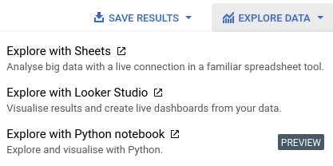

# Accessing WhatUp Data

> This document is to help people get access to WhatUp data


<!--ts-->
* [Accessing WhatUp Data](./110-accessing-data.md#accessing-whatup-data)
   * [Ways to see WhatUp Data](./110-accessing-data.md#ways-to-see-whatup-data)
   * [Ways to access data](./110-accessing-data.md#ways-to-access-data)
      * [WebUI with BigQuery](./110-accessing-data.md#webui-with-bigquery)
      * [WebUI with Colab](./110-accessing-data.md#webui-with-colab)
      * [WebUI with Looker or Sheets](./110-accessing-data.md#webui-with-looker-or-sheets)
         * [Method 1](./110-accessing-data.md#method-1)
         * [Method 2](./110-accessing-data.md#method-2)
         * [Method 3 (only Sheets)](./110-accessing-data.md#method-3-only-sheets)
      * [Python](./110-accessing-data.md#python)
   * [Ways of accessing third party data in BigQuery](./110-accessing-data.md#ways-of-accessing-third-party-data-in-bigquery)
      * [Sheets Source](./110-accessing-data.md#sheets-source)

<!-- Added by: runner, at: Fri Sep  8 10:46:04 UTC 2023 -->

<!--te-->


## Ways to see WhatUp Data

Because of the privacy concerns with the data, please keep the following in mind when accessing data.

- It is generally inadvisable to download a bulk export of data
- Do not share data without prior approval from team members
- Do not check data into any repository
- Do not email data
- It is preferable to stream data as opposed to saving it to disk


## Ways to access data

- WebUI with BigQuery (quick and easy)
- WebUI with Colab
- WebUI with Looker or GSheets
- Python


### WebUI with BigQuery

The steps are as follows,

1. Ask for access to the bigquery dataset
2. Log into bigquery (https://console.cloud.google.com/bigquery?project=whatup-395208)
3. Ensure you are viewing the correct project page (see circle #1 in the image below)
4. Pick the table you would like to query (see circle #2 in the image below)
5. To run SQL queries, select "query" and "in new tab" (see circle #3 in image below)

You can now run SQL queries against the data and see the results!

A good SQL query to start with to get 1000 messages is,

```sql
SELECT * FROM `whatup-395208.messages.messages` LIMIT 1000
```

These queries can also be saved. By default, when you save a query it will only be accessible to you unless you chose to save it with the "Visibility" set to "project". *NEVER SET VISIBILITY TO PUBLIC*

See the ["Useful SQL Queries"](150-useful-sql-queries.md) doc for more useful queries.


### WebUI with Colab

Follow the steps above in the ["WebUI with BigQuery"](#webui-with-bigquery) section and perform a query that filters the data you'd like to play with in a colab. Once you have the results you'd like, click "Explore Data" and select "Explore with Python notebook" (see image below).




### WebUI with Looker or Sheets

#### Method 1

From the BigQuery webui, select the table you would like to explore (for example, "messages" or "group_info"). Click "Export" and "Explore with Looker Studio" or "Explore with Sheets"(see image below).


#### Method 2

Follow the steps above in the ["WebUI with BigQuery"](#webui-with-bigquery) section and perform a query that filters the data you'd like to play with in a colab. Once you have the results you'd like, click "Explore Data" and select "Explore with Looker Studio" or "Explore with Sheets" (see image below).


#### Method 3 (only Sheets)

1. Create a new google sheet
2. Go to Data -> Data Connectors -> Connect to BigQuery
3. Select the "whatup" project and the "messages" dataset
4. Pick a table you would like to connect to your sheet and connect
    - Note: Instead of connecting to the full table, you can also write a custom SQL query to extract only the data you are interested in

You now have a sheet in your google sheet that has a view into the database. The sheet doesn't automatically refresh as the database changes. In order to do this, you need to click "Reresh options" and click "Refresh all" or set up a refresh schedule.


### Python

First request a service account that has access to view data. You will get a JSON file with the login credentials for this account. Please keep this file safe and do not publish it to a git repo or share it with other users!

Now use the [`google-cloud-bigquery`](https://cloud.google.com/python/docs/reference/bigquery/latest) package to access data

```python
from google.cloud import bigquery

# Replace these variables with your own values
project_id = 'whatup-395208'
private_key_path = 'path/to/your/keyfile.json'
dataset_id = 'messages'
table_id = 'group_info'

# Initialize the BigQuery client with your credentials
client = bigquery.Client.from_service_account_json(private_key_path, project=project_id)

# Define the BigQuery SQL query
sql_query = f"SELECT * FROM `{project_id}.{dataset_id}.{table_id}`"

# Run the query and get a query job
query_job = client.query(sql_query)

# Process and stream the results
for row in query_job:
    # Here, you can process each row as needed
    print(row)
```

Alternatively, if you want the results as a pandas DataFrame, replace the final for loop with,

```python
df = query_job.to_dataframe()
```


## Ways of accessing third party data in BigQuery

There are several ways to access third party data in BigQuery. In general, BigQuery is very adaptive and you should feel free to make new tables with temporary data that you would like to join to existing data. These tables can contain analysis results, custom filtering or search terms that you want to regularly refer to.

There is also a method to use Google sheets as a data-source that is accessible within BigQuery.


### Sheets Source

1. Create your google sheet with the data you would like to join to (an example can be seen [here](https://docs.google.com/spreadsheets/d/1XfmTxdeY2odLUX5SLkftwnyPNzIOwWmM7AxUQlXpYEk/edit). 
    - It is preferable to keep the underlying google sheet data in a known place like the "PROJECTS/WHATSAPP WATCH/Static Data/" directory in the Digital Witness Lab Google Drive
2. In the BigQuery WebUI, select the whatup project and click the "+ ADD" button in the Explorer (see image below)
3. Select "Google Drive" as the source
4. Paste a link to the Google Sheet in the "Select Drive URI" field
5. Select "Google Sheet" as the File Format
6. For "Data set", select "static_data"
7. Give the new table an informative name in the "Table" field. Ideally, this will also be the same name as the Google Sheet
8. Click Create Table

You should now see the new table in the "static_data" dataset! An example of joining to this data can be seen [here](150-useful-sql-queries.md#filtering-messages-by-keywords-in-second-table)


